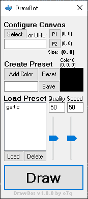

### **This program is still in very early-development, please report any bugs you find in the issues tab! I would also appreciate any feedback you have.**

 

# [<b>>> Download Latest</b>]()
### Welcome! DrawBot is a simple, universal drawing robot that works on nearly every game and program. (ex. Gartic Phone, Skribbl, Jackbox, Paint, etc.)

---

---

# Overview
DrawBot controls your mouse to artificially draw images on nearly any game or program.\
It can be quickly configured with with its simple preset system.

This program was inspired by https://github.com/IV2FI/DrawBot.

---

# Usage
**NOTE:** \
While drawing, you can push the **ESCAPE** key to abort the drawing process.

<!-- *You don't want to know how many times I screwed up my computer while developing DrawBot by making my mouse spazzing out. Don't worry, the program is pretty safe now, but I still kept the feature just in case of course.* 😉 -->

## Tutorial

<b>Step 1.</b> Select an image

- **1.1.** Click the **Select Button** OR paste in a direct URL to an image (URLs are prioritized, if you are using a local image ensure the URL textbox is empty)

<b>Step 2.</b> Define bounds

- **2.1.** Click the **P1 Button** and then click on the **top-left** of your canvas where the image will be drawn, this will define the first point
- **2.2** Click the **P2 Button** and then click on the **bottom-right** of your canvas where the image will be drawn, this will define the second point

<b>Step 3.</b> Create or load a preset

- To create a preset
    - Note: *The preset system only saves the color and the coordinate of that color.*
    - **3.1.** Click the **Add Color Button** and then click on a color on the visible color palette of the program/game
    - **3.2.** Repeat step **3.1** until you have selected all of the colors you need (note: it does not matter in which order you select them, the program will automatically determine which color to use when drawing, also, you can click the **Reset Button** to restart the preset creation process)
    - **3.3.** Name the preset by typing a name inside the textbox, click the **Save Button** to save it
- To load a preset
    - **3.1.** Select a preset inside of the **Preset List**
    - **3.2.** Click the **Load Button** to load the selected preset (note: click the **Delete Button** to delete the selected preset)

<b>Step 4.</b> Drawing

- **4.1.** Determine the draw settings with the **Quality** and **Speed** sliders. Quality will increase the pixel density at the cost of slowness. Speed will increase speed, speeds too high can cause issues on some programs/games
- **4.2.** Click the **Draw Button** to start! **Remember:** You can push the **ESCAPE** key to abort the drawing process.

*Video tutorial coming soon*

 

## Interface
- Canvas Configuration
    - **Select Image Button** Opens a file dialog to select a local image
    - **URL Image Textbox** Uses a URL from the internet instead of a local image (URL image is prioritized, ensure it is blank if you are using a local image)
    - **Bounding Box Configuration**
        - **P1 Button** (Point-1) Select the top-left point of the drawing area
        - **P2 Button** (Point-2) Select the bottom-right point of the drawing area
- Preset Creator
    - **Add Color Button** Adds a new color to the usable colors in the preset (it does not matter which order you put them in)
    - **Reset Button** Clears the entire preset process
    - **Preset Name Textbox** Name for the preset
    - **Save Button** Save the preset to a file so it can be loaded later
- Preset Loader
    - **Preset List** Displays all of the user-created presets
    - **Load Button** Loads the selected preset
    - **Delete Button** Deletes the selected preset
- Quality/Speed Controllers
    - **Quality Slider** Change the pixel density of the image (higher looks better but is slower)
    - **Speed Slider** Change the speed of the drawing process (if set too high it can cause issues in some programs)
- **Draw Button** Draws the selected image with select configuration

---

**DrawBot** \
Written in C# with .NET Framework 4.8