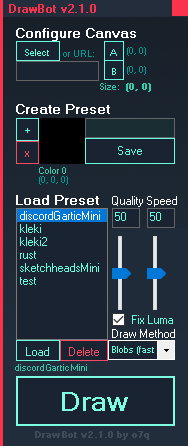

# [<b>>> Download Latest</b>](https://github.com/o7q/DrawBot/releases/download/v2.1.0.0/DrawBot.exe)
### Welcome! DrawBot is a simple, versatile drawing robot that works in nearly every game and program. (ex. Gartic Phone, Skribbl, Jackbox, Paint, etc.)

---

---

# Overview
DrawBot controls your mouse to artificially draw images. It works on nearly every game and program.\
It can be quickly configured with its simple preset system.

This program was inspired by https://github.com/IV2FI/DrawBot.

---

# Usage
**NOTE:** \
While drawing, you can push the **ESCAPE** key to abort the drawing process.

<!-- *You don't want to know how many times I screwed up my computer while developing DrawBot by making my mouse spazzing out. Don't worry, the program is pretty safe now, but I still kept the feature just in case of course.* 😉 -->

## Tutorial

<b>Step 1.</b> Select an image

- **1.1** Click the **Select Button** OR paste in a direct URL to an image (URLs are prioritized, if you are using a local image ensure the URL textbox is empty)

<b>Step 2.</b> Define bounds

- **2.1** Click the **A Button** and then click on the **top-left** of your canvas where the image will be drawn, this will define the first point
- **2.2** Click the **B Button** and then click on the **bottom-right** of your canvas where the image will be drawn, this will define the second point

<b>Step 3.</b> Create or load a preset

- To create a preset
    - Note: *The preset system will save all colors that you select, click "Save" only when you've selected all of the colors you wanted for that preset.
    - **3.1** Click the **Add Color Button (+)** and then click on a color on the visible color palette of the program/game
    - **3.2** Repeat step **3.1** until you have selected all of the colors you need (note: it does not matter in which order you select them, the program will automatically determine which color to use when drawing, also, you can click the **Reset Button** to restart the preset creation process)
    - **3.3** Name the preset by typing a name inside the textbox, click the **Save Button** to save it
- To load a preset
    - **3.1** Select a preset inside of the **Preset List**
    - **3.2** Click the **Load Button** to load the selected preset (note: click the **Delete Button** to delete the selected preset)

<b>Step 4.</b> Drawing

- **4.1** Determine the draw settings with the **Quality** and **Speed** sliders. Quality will increase the pixel density at the cost of slowness. Speed will increase speed, speeds too high can cause issues on some programs/games
- **4.2** Select the draw method (info about these are at the bottom of the interface dictionary)
- **4.3** Click the **Draw Button** to start! **Remember:** You can push the **ESCAPE** key to abort the drawing process.

*Video tutorial coming, maybe.*

 

## Interface
- Canvas Configuration
    - **Select Image Button** Opens a file dialog to select a local image
    - **URL Image Textbox** Uses a URL from the internet instead of a local image (URL image is prioritized, ensure it is blank if you are using a local image)
    - **Bounding Box Configuration**
        - **A Button** (Point-1) Select the top-left point of the drawing area
        - **B Button** (Point-2) Select the bottom-right point of the drawing area
- Preset Creator
    - **+ Button** Adds a new color to the usable colors in the preset (it does not matter which order you put them in)
    - **x Button** Removes the last added color
    - **Preset Name Textbox** Name for the preset
    - **Save Button** Save the preset to a file so it can be loaded later
- Preset Loader
    - **Preset List** Displays all of the user-created presets
    - **Load Button** Loads the selected preset
    - **Delete Button** Deletes the selected preset
- Quality/Speed Controllers
    - **Quality Slider** Change the pixel density of the image (higher looks better but is slower)
    - **Speed Slider** Change the speed of the drawing process (if set too high it can cause issues in some programs)
- Draw Methods
    - **Strips (quality)** A method that draws row by row, this method guarantees quality
    - **Blobs (fast)** A method that draws by drawing colors in groups, this method guarantees speed
- **Draw Button** Draws the selected image with current settings

---

**DrawBot** \
Written in C# with .NET Framework 4.8